# PAYI App — Complete Flow Diagrams

## 1. App Startup & Authentication Flow

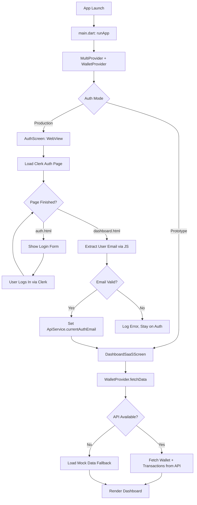

---

## 2. Dashboard Navigation Map

```mermaid
flowchart TD
    DASH[Dashboard Screen] --> SEARCH[Search Bar → Search Contacts]
    DASH --> PROFILE[Profile Avatar → Profile Screen]
    DASH --> SCAN_BTN[Scan Pill → Scan QR Screen]
    DASH --> BAL_BTN[Balance Pill → Balance Details]

    DASH --> G1[Grid: Scan any QR → Scan QR Screen]
    DASH --> G2[Grid: Pay Contacts → Transfer Screen]
    DASH --> G3[Grid: Pay to Phone → Transfer Screen]
    DASH --> G4[Grid: Bank Transfer → Bank Transfer Screen]
    DASH --> G5[Grid: Pay Bills → Pay Bills Screen]
    DASH --> G6[Grid: Wallet Top-up → Top-up Screen]
    DASH --> G7[Grid: Receive Money → Receive Money Screen]
    DASH --> G8[Grid: Settings → Settings Screen]

    DASH --> PEOPLE[People Section]
    PEOPLE --> P_ALEX[Alex → Transfer Screen]
    PEOPLE --> P_SARAH[Sarah → Transfer Screen]
    PEOPLE --> P_MIKE[Mike → Transfer Screen]
    PEOPLE --> P_EMMA[Emma → Transfer Screen]
    PEOPLE --> P_TOPUP[Topup → Top-up Screen]

    DASH --> TX_LIST[Recent History]
    TX_LIST --> TX_DETAIL[Transaction Details Screen]
```

---

## 3. Send Money / Transfer Flow

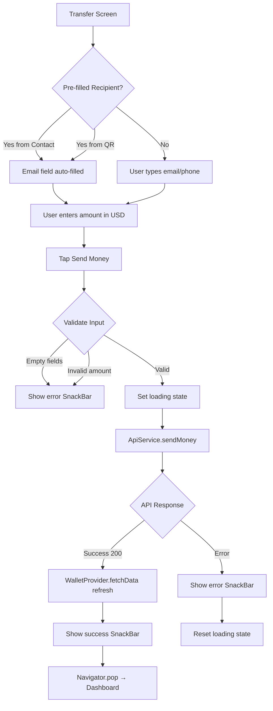

---

## 4. QR Scan Flow

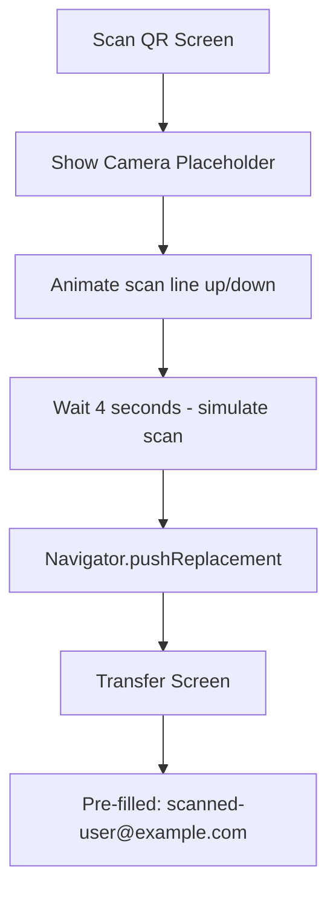

---

## 5. Bank Transfer Flow

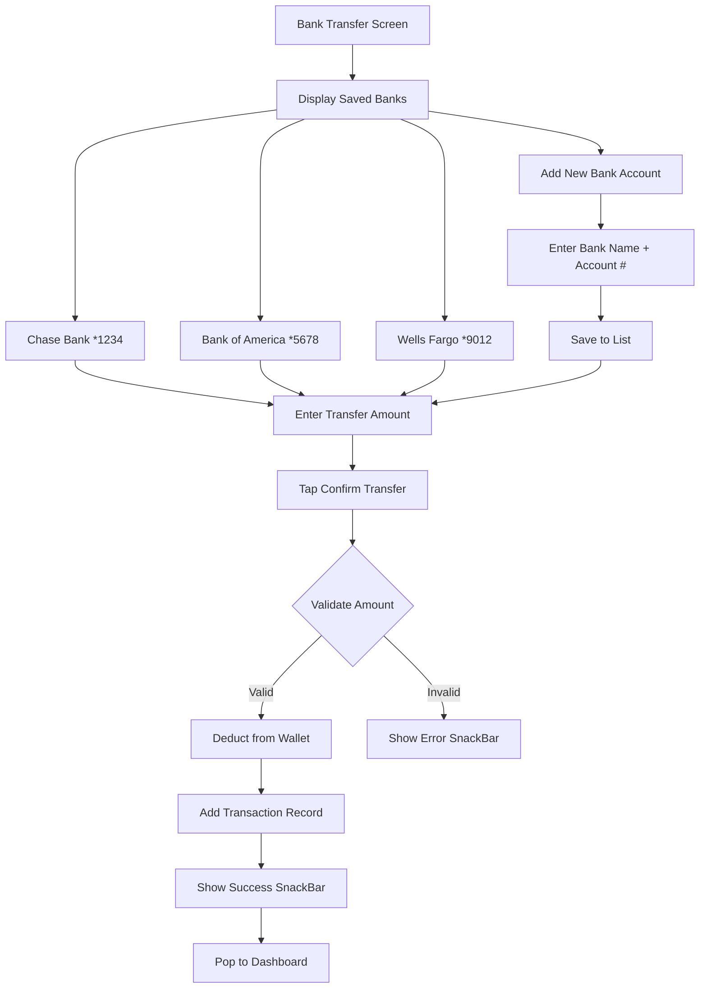

---

## 6. Wallet Top-up Flow

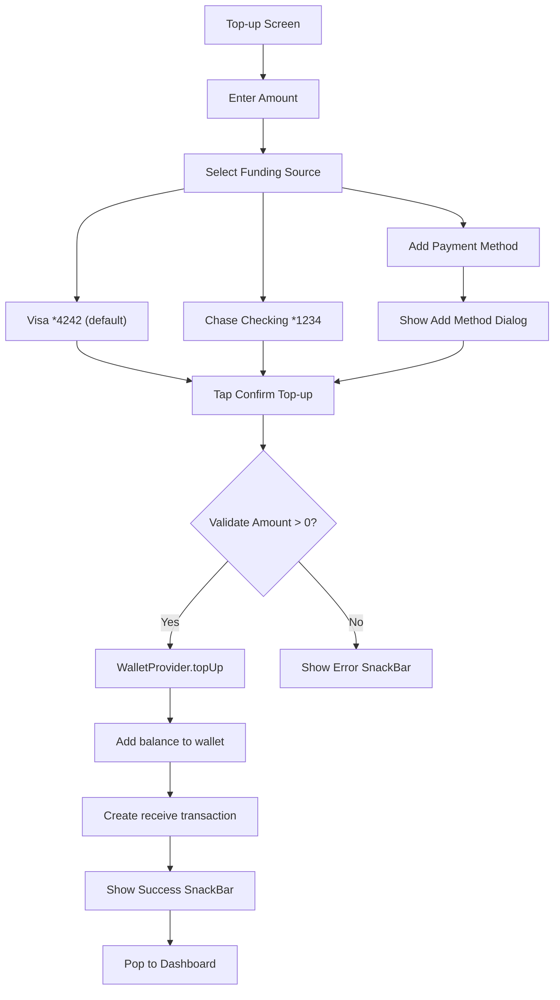

---

## 7. Pay Bills Flow

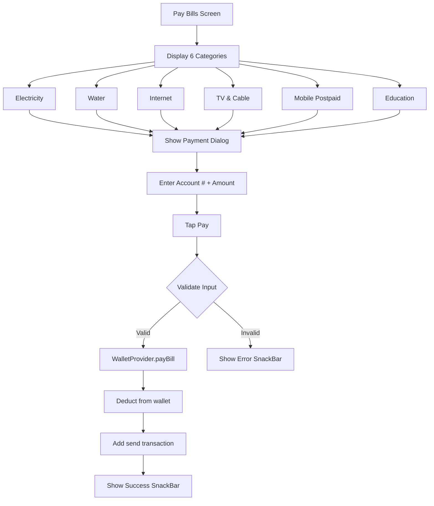

---

## 8. Receive Money Flow

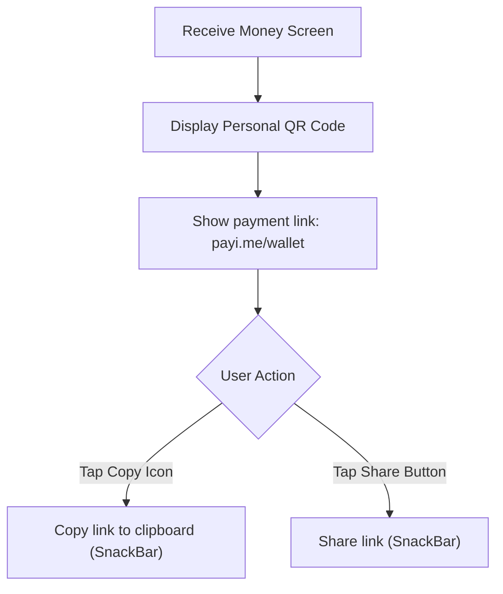

---

## 9. Profile & Settings Navigation

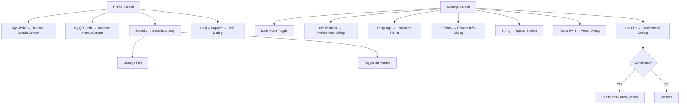

---

## 10. Data Layer Architecture

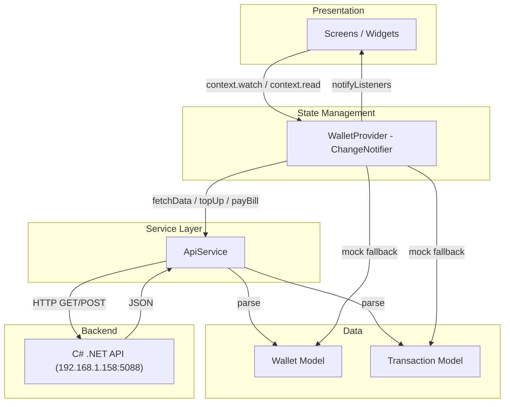

---

## 11. Complete Screen Map

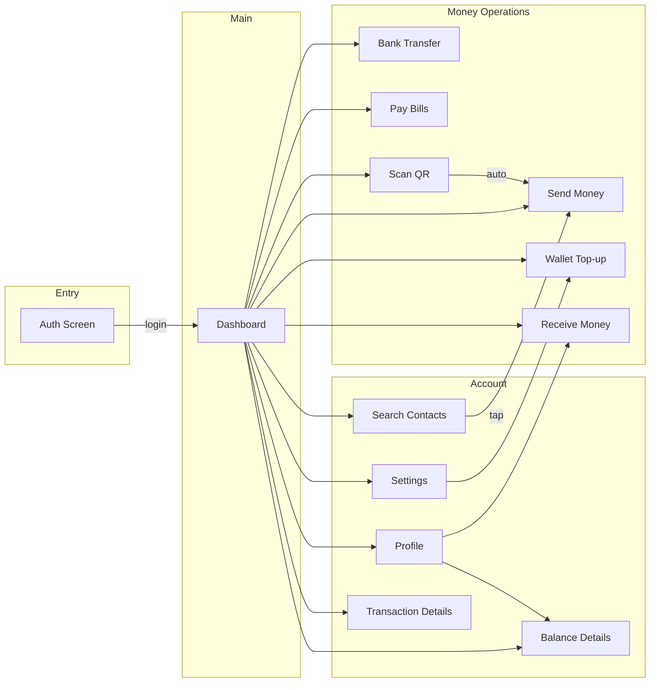
